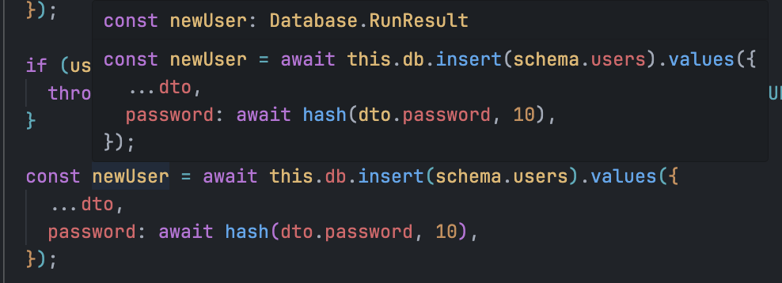
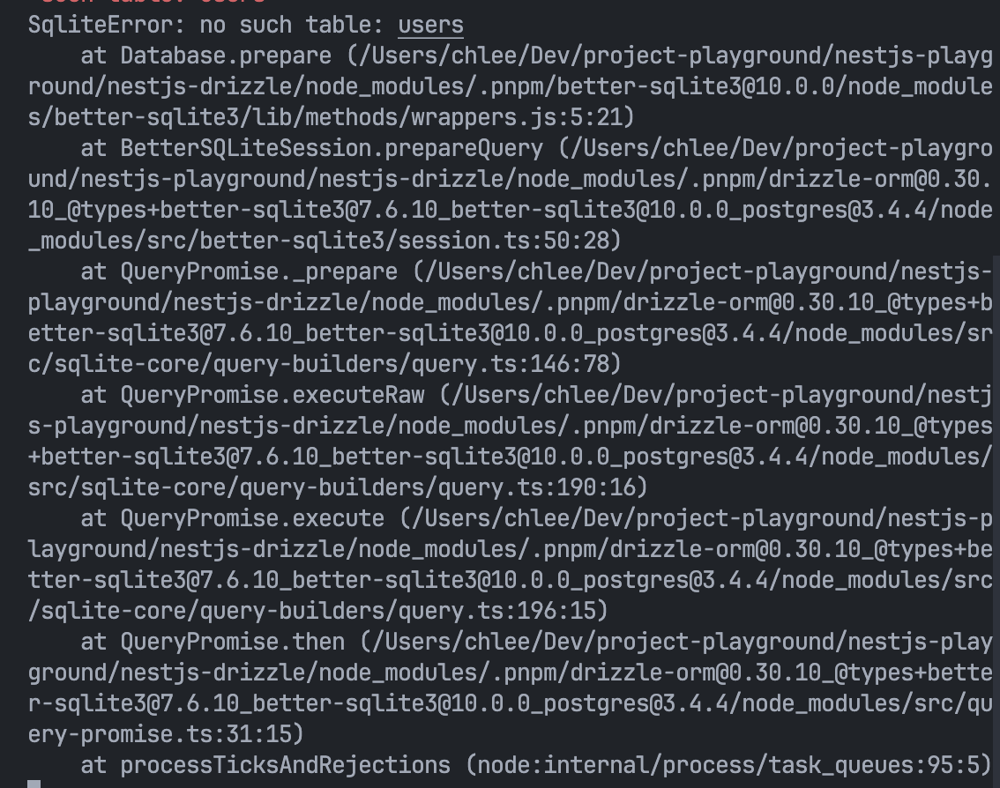

## 참고자료
- https://www.youtube.com/watch?v=l1DGXmmgZ9w
-https://mycodings.fly.dev/blog/2023-12-09-quick-understanding-of-drizzle-orm


### Dependency
- [better-sqlite3](https://github.com/WiseLibs/better-sqlite3)
- [drizzle-orm](https://github.com/drizzle-team/drizzle-orm)
- [drizzle-kit](https://github.com/drizzle-team/drizzle-kit-mirror)


## 1) 필요한 의존성 설치하기 

- [better-sqlite3](https://github.com/WiseLibs/better-sqlite3)
- [drizzle-orm](https://github.com/drizzle-team/drizzle-orm)
- [drizzle-kit](https://github.com/drizzle-team/drizzle-kit-mirror)

```ts
pnpm add better-sqlite3 drizzle-orm 
pnpm add -D drizzle-kit
```


## 2) drizzle 모듈 & 스키마 생성

drizzle 모듈 생성
```ts
nest g mo drizzle 
```

drizzle schema.ts 파일 생성
```ts
// src/drizzle/schema.ts
touch schema.ts
```


## 3) User Table 정의
```ts
import { integer, sqliteTable, text } from 'drizzle-orm/sqlite-core';

export const users = sqliteTable('users', {
  id: integer('id', { mode: 'number' }).primaryKey({ autoIncrement: true }),
  username: text('username'),
  email: text('email'),
  password: text('password'),
});

export type User = typeof users.$inferSelect;
export type NewUser = typeof users.$inferInsert;

```


## 4) Drizzle Provider 제작
```ts
import * as Database from 'better-sqlite3';
import { drizzle } from 'drizzle-orm/better-sqlite3';
import * as schema from './schema';

export const DrizzleAsyncProvider = 'drizzleProvider';

export const drizzleProvider = {
  provide: DrizzleAsyncProvider,
  useFactory: async () => {
    const sqlite = new Database(process.env.DATABASE_URL, {
      fileMustExist: true,
    });
    const db = drizzle(sqlite, { schema });
    return db;
  },
  exports: [DrizzleAsyncProvider],
};

```


## 5) Drizzle Provider 사용
```ts
@Injectable()
export class UserService {
  constructor(
    @Inject(DrizzleAsyncProvider)
    private db: BetterSQLite3Database<typeof schema>,
  ) {}
  . . . 
}
```


### .returning(); 사용하기
drizzle-orm 을 사용할때는 returning() 을 사용해서 새롭게 생성된 raw 에 대한 정보를 반환 할 수 있다.

```ts
const newUser = await this.db
  .insert(schema.users)
  .values({
    ...dto,
    password: await hash(dto.password, 10),
  })
  .returning();
```


별도로 returning 을 사용하지 않으면 생성된 raw 에 대한 정보를 반환 받을 수 없다.




returning 에 인자값을 넣음으로써  생성된 raw 에 대한 정보를 반환 받을 수 있다.

```ts
// Insert one row and return all fields
const insertedCar: Car[] = await db.insert(cars)
  .values({ brand: 'BMW' })
  .returning();

// Insert one row and return only the id
const insertedCarId: { id: number }[] = await db.insert(cars)
  .values({ brand: 'BMW' })
  .returning({ id: cars.id });
```

--------

## error

### SqliteError: no such table: users

- https://www.learnwithjason.dev/blog/drizzle-orm-sqlite-create-tables/
- https://github.com/WiseLibs/better-sqlite3/issues/220




## drizzle 을 사용해보고 느낀점

1. prisma 만을 써왔던 내 경험상으로 가장 큰 장점은 아무래도 스키마를 별도의 파일로 나눠서 작성할 수 있다는 점이었다.
  prisma 의 경우 schema.prisma 라는 하나의 파일에 모든 모델링을 해야했다. 아니면 [Prismix 과 같은 utilizes 를 사용하거나 별도의 shell 스크립트를 제작하여 사용해야했다](https://stackoverflow.com/questions/71163623/how-to-split-prisma-model-into-separate-file).
  하지만, 이 경우에는 Table 간의 Relation 을 설정하는 과정에서 prisma extension 의 도움을 받을 수 없다는 단점이 생긴다.
  이로 인해 schema.prisma 는 하나의 파일로 관리한다는것이 거의 정석적으로 사용되어 왔다.
  하지만, drizzle 의 경우 sqliteTable 과 같은 함수를 통해 schema 를 제작함으로써 Table 정의를 나눠서 할 수 있다는점에서 큰 장점으로 느껴졌다.

2. query builder 형식과 prisma query 2가지 방식을 모두 지원한다는점도 하나의 장점으로 느껴졌다.
3. npm 통계상의 수치로는 prisma 보다 drizzle 의 빌드 사이즈가 훨씬 작다는점도 장점으로 느껴졌다.
4. prisma 에서 지원하는 push/generate/migrate 등의 명령어를 drizzle 에서도 동일하게 제공한다는점에서 orm 을 변경할때 학습 커브가 비교적 낮았다. 
  