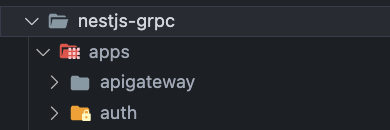

## nestjs-grpc

## protoc(Protocol Buffer Compiler) 다운로드 

### 1) protobuf 설치하기

`*.proto` 파일을 컴파일하여 `ts` 파일로 만들기 위해서는 `protoc` 라는 컴파일 도구가 필요하며,  
이를 위해서는 `brew install protobuf` 명령어를 사용해 다운로드 받을 수 있다.


### 2) 설치 완료 체크하기
`protoc --version` 명령어로 버전 체크를 진행하며, 정상적으로 다운로드 되었는지 확인한다.


<br/>


## msa 프로젝트로 변경
`nest g app auth` 명령어를 실행하게 되면 프로젝트가 `msa` 프로젝트로 변경되며 `monorepo` 형식으로 구성된다.  
새롭게 생성된 auth 프로젝트와 기존의 프로젝트는 `apps/*` 폴더 하위에 재배치 되며, `nest-cli.json` 의 내용도 아래와 같이 업데이트 된다.

- 폴더 구성


- nest-cli.json 구성
  
```json
# nest-cli.json
{
  "$schema": "https://json.schemastore.org/nest-cli",
  "collection": "@nestjs/schematics",
  "sourceRoot": "apps/apigateway/src",
  "compilerOptions": {
    "deleteOutDir": true,
    "webpack": true,
    "tsConfigPath": "apps/apigateway/tsconfig.app.json"
  },
  "monorepo": true,
  "root": "apps/apigateway",
  "projects": {
    "apigateway": {
      "type": "application",
      "root": "apps/apigateway",
      "entryFile": "main",
      "sourceRoot": "apps/apigateway/src",
      "compilerOptions": {
        "tsConfigPath": "apps/apigateway/tsconfig.app.json"
      }
    },
    "auth": {
      "type": "application",
      "root": "apps/auth",
      "entryFile": "main",
      "sourceRoot": "apps/auth/src",
      "compilerOptions": {
        "tsConfigPath": "apps/auth/tsconfig.app.json"
      }
    }
  }
}
```

<br/>

## nestjs-grpc 프로젝트 이름을 apigateway 로 변경
`nest g app auth` 명령어를 통해 `apps/` 폴더 하위에 재배치된 `auth`, `nestjs-grpc` 프로젝트중 `nestjs-grpc` 프로젝트의 이름을 `apigateway` 로 변경한다.
이제 `apigateway` 폴더는 케이트웨이 용도의 프로젝트로 구성한다.

더불어, 프로젝트 이름 변경으로 인해 수정이 필요한 파일들을 찾아 수정한다.  
( Crtl + Shift + F > nestjs-grpc 찾기 > apigateway 로 전체 변경 )




<br/>

## apps/auth 프로젝트 수정
1. `auth.module.ts` 를 제외한 `controller/service/test` 제거
2. `nest g resource users` 명령어를 사용해 `apps/auth/src/users` 모듈 생성 
   


일련의 과정을 거치면 아래와 같이 `apps/auth/` 폴더 하위에 아래의 구조도와 같이 `users` 폴더가 생성되는것을 확인 할 수 있다.

> nestjs-cli 를 거의 사용하지 않았다보니 신기했던것은 경로 지정 부터 Transport Layer 타입/CRUD 등을 선택하고 자동으로 생성할 수 있다는점이었다.
> 나는 왜.. 그동안 Crtl + c & Crtl + v 를 애용했는가...

```bash
.
├── auth.module.ts
├── main.ts
└── users
    ├── dto
    │   ├── create-user.dto.ts
    │   └── update-user.dto.ts
    ├── entities
    │   └── user.entity.ts
    ├── users.controller.spec.ts
    ├── users.controller.ts
    ├── users.module.ts
    ├── users.service.spec.ts
    └── users.service.ts
```

<br/>

## msa & gRPC 의존성 설치

필요한 의존성 목록
- @nestjs/microservices : msa
- @grpc/grpc-js : gRPC
- @grpc/proto-loader : gRPC
- ts-proto : gRPC(*.proto -> *.ts 변환)


```bash
  pnpm install -D @nestjs/microservices @grpc/grpc-js @grpc/proto-loader ts-proto
```

<br/>

### gRPC - *.proto 정의하기
`root` 경로에 `proto/` 폴더를 생성하고 `auth.proto` 파일을 작성한다.

> 한가지 특이한점은 message<Users> 를 만들때 User[] 와 같이 선언하지 않고 `repeated` 키워드를 사용한다는점이었다. 
> 그리고, prisma 에서 schema, Terraform 에서 Iac 작성하는 느낌이었다.

```proto
syntax = "proto3";


// # 패키지명 정의
package auth;

// # 서비스 메서드 정의
service UsersService {
  rpc CreateUser (CreateUserDto) returns (User) {}
  rpc FindAllUsers (Empty) returns (Users) {}
  rpc FindOneUser (FindOneUserDto) returns (User) {}
  rpc UpdateUser (UpdateUserDto) returns (User) {}
  rpc RemoveUser (FindOneUserDto) returns (User) {}
  rpc QueryUsers (stream PaginationDto) returns (stream Users) {}
}

// # CreateUserDto 형식 정의
message CreateUserDto {
  string username = 1;
  string password = 2;
  int32 age = 3;
}

// # FindOneUserDto 형식 정의
message FindOneUserDto {
  string id = 1;
}

// # UpdateUserDto 형식 정의
message UpdateUserDto {
  string id = 1;
  SocialMedia socialMedia = 2;
}

// # PaginationDto 형식 정의
message PaginationDto {
  int32 page = 1;
  int32 size = 2;
}

// # input/output 이 없는 경우의 형식 정의
message Empty {}

// # 전송할 메시지 형식 정의 -> Users
message Users {
  repeated User users = 1;
}

// # 전송할 메시지 형식 정의 -> User
message User {
  string id = 1; 
  string username = 2; 
  string password = 3;
  int32 age = 4;
  bool subscribed = 5;
  SocialMedia socialMedia = 6;
}

message SocialMedia {
  optional string twitterUri = 1; 
  optional string facebookUri = 2;
}
```

<br/>


## `*.proto` 파일 `ts` 전환
이제 드디어 protobuf 를 컴파일 할 수 있었다..

> ts-proto 를 npm 에서 설치한다고 protoc 를 사용할 수 있는게 아니였다.
> protobuf 를 컴파일 하기 위한 도구로써 brew install 명령어를 사용해서 다운로드 받아야 한다. (해당 문서 제일 윗부분 내용을 참조.)

```bash
  protoc --plugin=./node_modules/.bin/protoc-gen-ts_proto --ts_proto_out=./ --ts_proto_opt=nestJs=true ./proto/auth.proto
```

명령어를 실행하면 요렇게 `*.ts` 파일이 생성된다.


생성된 `*.ts` 파일의 코드는 아래와 같다!
이렇게 만들어진 코드로 service, controller 를 작성해야한다.

```ts
/* eslint-disable */
import { GrpcMethod, GrpcStreamMethod } from "@nestjs/microservices";
import { Observable } from "rxjs";

export const protobufPackage = "auth";

/** # CreateUserDto 형식 정의 */
export interface CreateUserDto {
  username: string;
  password: string;
  age: number;
}

/** # FindOneUserDto 형식 정의 */
export interface FindOneUserDto {
  id: string;
}

/** # UpdateUserDto 형식 정의 */
export interface UpdateUserDto {
  id: string;
  socialMedia: SocialMedia | undefined;
}

/** # PaginationDto 형식 정의 */
export interface PaginationDto {
  page: number;
  size: number;
}

/** # input/output 이 없는 경우의 형식 정의 */
export interface Empty {
}

/** # 전송할 메시지 형식 정의 -> Users */
export interface Users {
  users: User[];
}

/** # 전송할 메시지 형식 정의 -> User */
export interface User {
  id: string;
  username: string;
  password: string;
  age: number;
  subscribed: boolean;
  socialMedia: SocialMedia | undefined;
}

export interface SocialMedia {
  twitterUri?: string | undefined;
  facebookUri?: string | undefined;
}

export const AUTH_PACKAGE_NAME = "auth";

/** # 서비스 메서드 정의 */

export interface UsersServiceClient {
  createUser(request: CreateUserDto): Observable<User>;

  findAllUsers(request: Empty): Observable<Users>;

  findOneUser(request: FindOneUserDto): Observable<User>;

  updateUser(request: UpdateUserDto): Observable<User>;

  removeUser(request: FindOneUserDto): Observable<User>;

  queryUsers(request: Observable<PaginationDto>): Observable<Users>;
}

/** # 서비스 메서드 정의 */

export interface UsersServiceController {
  createUser(request: CreateUserDto): Promise<User> | Observable<User> | User;

  findAllUsers(request: Empty): Promise<Users> | Observable<Users> | Users;

  findOneUser(request: FindOneUserDto): Promise<User> | Observable<User> | User;

  updateUser(request: UpdateUserDto): Promise<User> | Observable<User> | User;

  removeUser(request: FindOneUserDto): Promise<User> | Observable<User> | User;

  queryUsers(request: Observable<PaginationDto>): Observable<Users>;
}

export function UsersServiceControllerMethods() {
  return function (constructor: Function) {
    const grpcMethods: string[] = ["createUser", "findAllUsers", "findOneUser", "updateUser", "removeUser"];
    for (const method of grpcMethods) {
      const descriptor: any = Reflect.getOwnPropertyDescriptor(constructor.prototype, method);
      GrpcMethod("UsersService", method)(constructor.prototype[method], method, descriptor);
    }
    const grpcStreamMethods: string[] = ["queryUsers"];
    for (const method of grpcStreamMethods) {
      const descriptor: any = Reflect.getOwnPropertyDescriptor(constructor.prototype, method);
      GrpcStreamMethod("UsersService", method)(constructor.prototype[method], method, descriptor);
    }
  };
}

export const USERS_SERVICE_NAME = "UsersService";
```

<br/>

## lib/common 폴더 생성 및 proto/*.ts 파일을 common/types/ 로 이동


`nest g lib common` 명령어로 common 폴더 생성.
주의할점은 이때 생성되는 lib/common 폴더의 경우 monorepo 의 워크스페이스중 하나로 생성된다.


최종적으로 proto/*.ts 파일을 다 옮기고 나면 아래와 같은 형식이 된다.


<br/>

## apps/auth/users 코드 작성
main/controller/service 의 코드를 작성한다.
기존의 API 코드 작성과 다른점은 *.proto 파일을 컴파일한 *.ts 에서 controller/service/dto 를 활용하여 코드를 작성한다는점이다.


### 1) msa service 생성
`apps/auth/main.ts` 파일에서 `createMicroservice()` 를 사용해 msa 서비스를 생성한다.
이때, AuthModule 을 사용하는데 UsersModule 이 포함되어 있다.

```ts
import { NestFactory } from '@nestjs/core';
import { AuthModule } from './auth.module';
import { MicroserviceOptions, Transport } from '@nestjs/microservices';
import { join } from 'path';
import { AUTH_PACKAGE_NAME } from '@app/common';

async function bootstrap() {
  const app = await NestFactory.createMicroservice<MicroserviceOptions>(
    AuthModule,
    {
      transport: Transport.GRPC, // transport 방식 설정
      options: {
        protoPath: join(__dirname, '../auth.proto'),  // 사용할 *.proto 경로 설정
        package: AUTH_PACKAGE_NAME, // 패키지명 설정
      },
    },
  );

  await app.listen();
}
bootstrap();
```

### 2) UsersController 작성
```ts
import { Controller } from '@nestjs/common';
import {
  CreateUserDto,
  UpdateUserDto,
  UsersServiceController,
  UsersServiceControllerMethods,
  FindOneUserDto,
  PaginationDto,
} from '@app/common'; // *.proto -> *.ts 로 컴파일한 코드 사용
import { UsersService } from './users.service';
import { Observable } from 'rxjs';

@Controller()
@UsersServiceControllerMethods()
export class UsersController implements UsersServiceController {
  constructor(private readonly usersService: UsersService) {}

  createUser(createUserDto: CreateUserDto) {
    return this.usersService.create(createUserDto);
  }

  findAllUsers() {
    return this.usersService.findAll();
  }

  findOneUser(findOneUserDto: FindOneUserDto) {
    return this.usersService.findOne(findOneUserDto.id);
  }

  updateUser(updateUserDto: UpdateUserDto) {
    return this.usersService.update(updateUserDto.id, updateUserDto);
  }

  removeUser(removeUserDto: FindOneUserDto) {
    return this.usersService.remove(removeUserDto.id);
  }

  queryUsers(paginationDtoStream: Observable<PaginationDto>) {
    return this.usersService.queryUsers(paginationDtoStream);
  }
}
```


### 3) UsersService 작성
DB 는 사용하지 않고 로컬에 users[] 를 만들어 사용했다.

```ts
import { Injectable, NotFoundException } from '@nestjs/common';
import { CreateUserDto, UpdateUserDto, User, Users } from '@app/common'; // *.proto -> *.ts 로 컴파일한 코드 사용
import { randomUUID } from 'crypto';
import { PaginationDto } from '../../../../libs/common/src/types/auth';
import { Observable, Subject } from 'rxjs';

@Injectable()
export class UsersService {
  private readonly users: User[] = [];

  create(createUserDto: CreateUserDto) {
    const user: User = {
      ...createUserDto,
      subscribed: false,
      socialMedia: {},
      id: randomUUID(),
    };

    this.users.push(user);
    return user;
  }

  findAll(): Users {
    return { users: this.users };
  }

  findOne(id: string): User {
    return this.users.find((user) => user.id === id);
  }

  update(id: string, updateUserDto: UpdateUserDto) {
    const userIndex = this.users.findIndex((user) => user.id === id);
    if (userIndex !== -1) {
      this.users[userIndex] = {
        ...this.users[userIndex],
        ...updateUserDto,
      };
      return this.users[userIndex];
    }
    throw new NotFoundException(`User not found by id ${id}`);
  }

  remove(id: string) {
    const userIndex = this.users.findIndex((user) => user.id === id);
    if (userIndex !== -1) {
      return this.users.splice(userIndex)[0];
    }
    throw new NotFoundException(`User not found by id ${id}`);
  }

  queryUsers(
    paginationDtoStream: Observable<PaginationDto>,
  ): Observable<Users> {
    const subject = new Subject<Users>();

    const onNext = (paginationDto: PaginationDto) => {
      const start = paginationDto.page * paginationDto.skip;
      subject.next({
        users: this.users.slice(start, start + paginationDto.skip),
      });
    };

    const onComplete = () => subject.complete();

    // paginationDtoStream 데이터를 구독.
    // paginationDtoStream 를 onNext() 의 인자로 사용.
    // 스트림이 완료되면 onComplete() 호출.
    paginationDtoStream.subscribe({ next: onNext, complete: onComplete });

    // 외부에서 사용할 수 있도록 Observable 형태로 반환
    return subject.asObservable();
  }
}

```

<br/>


## 정상동작 여부 확인 - auth msa service 실행

`pnpm start:dev auth` 명령어를 실행하여 정상적으로 동작하는지 확인한다.


## apigateway 폴더에 user(rest api) 추가 및 msa(auth) gRPC Client 연동

apigateway 에도 user 엔드포인트를 만들기 위해 `nest g resource users` 명령어를 통해 폴더를 생성한다.


<br/>

이제 게이트웨이 폴더에도 users 에 대한 controller, service 를 생성하게 될텐데 "*.proto -> *.ts 로 컴파일한 코드 사용" 한다는점과
UsersService 코드에서 `auth/users/users.service.ts` 의 내용을 사용한다는점만 유의하면 된다.

### 게이트웨이 > UsersController
일반적인 API Controller 와 동일하다.

```ts
import {
  Controller,
  Get,
  Post,
  Body,
  Patch,
  Param,
  Delete,
} from '@nestjs/common'; // *.proto -> *.ts 로 컴파일한 코드 사용
import { UsersService } from './users.service';
import { CreateUserDto, UpdateUserDto } from '@app/common';

@Controller('users')
export class UsersController {
  constructor(private readonly usersService: UsersService) {}

  @Post()
  create(@Body() createUserDto: CreateUserDto) {
    return this.usersService.create(createUserDto);
  }

  @Get()
  findAll() {
    return this.usersService.findAll();
  }

  @Get(':id')
  findOne(@Param('id') id: string) {
    return this.usersService.findOne(id);
  }

  @Patch(':id')
  update(@Param('id') id: string, @Body() updateUserDto: UpdateUserDto) {
    return this.usersService.update(id, updateUserDto);
  }

  @Delete(':id')
  remove(@Param('id') id: string) {
    return this.usersService.remove(id);
  }

  @Post('email')
  emailUsers() {
    return this.usersService.emailUser();
  }
}

```


### 게이트웨이 > UsersService
일반적인 API 의 service 와는 구성 방식이 조금 다르다.  

[유의사항]
- DI 부분에서 auth msa 의 UserServiceClient 를 가져온뒤 주입하여 사용하기 때문에 생성자(constructor) 부분에서 작성에 유의 해야한다.
- emailUser 와 emailUser > queryUsers 부분에서는 `rxjs` 가 사용되어 처음 코드를 읽을때 어려울 수 있다. (데이터 조회-> 4부분으로 chunk 분리-> console 출력)

```ts
import { Inject, Injectable } from '@nestjs/common';
import {
  UpdateUserDto,
  USERS_SERVICE_NAME,
  CreateUserDto,
  UsersServiceClient,
  PaginationDto,
} from '@app/common';
import { ClientGrpc } from '@nestjs/microservices';
import { AUTH_SERVICE_NAME } from '../constants';
import { ReplaySubject } from 'rxjs';

@Injectable()
export class UsersService {
  // users gRPC service client 선언
  private usersService: UsersServiceClient;

  // AUTH_SERVICE_NAME 주입.
  // client gRPC 타입의 client 변수 선언
  constructor(@Inject(AUTH_SERVICE_NAME) private client: ClientGrpc) {}

  OnModuleInit() {
    // USERS_SERVICE_NAME 라는 이름의 gRPC service client 를 가져와 usersService 에 할당.
    this.usersService =
      this.client.getService<UsersServiceClient>(USERS_SERVICE_NAME);
  }

  create(createUserDto: CreateUserDto) {
    return this.usersService.createUser(createUserDto);
  }

  findAll() {
    return this.usersService.findAllUsers({});
  }

  findOne(id: string) {
    return this.usersService.findOneUser({ id });
  }

  update(id: string, updateUserDto: UpdateUserDto) {
    return this.usersService.updateUser({ id, ...updateUserDto });
  }

  remove(id: string) {
    return this.usersService.removeUser({ id });
  }

  emailUser() {
    const users$ = new ReplaySubject<PaginationDto>();

    users$.next({ page: 0, skip: 25 });
    users$.next({ page: 1, skip: 25 });
    users$.next({ page: 2, skip: 25 });
    users$.next({ page: 3, skip: 25 });

    users$.complete();

    let chunkNum = 1;

    this.usersService.queryUsers(users$).subscribe((users) => {
      console.log('Chunk', chunkNum, users);
      chunkNum += 1;
    });
  }
}

```

<br/>

## 참고자료
- [gRPC 공식 홈페이지](https://grpc.io/)
- [Protocol Buffer Compiler Installation (ts-proto 설치해도 protoc 명령어 사용할려면 다운받아야함)](https://grpc.io/docs/protoc-installation/)

- [nestjs 공식 문서 번역 / gitbook](https://jakekwak.gitbook.io/nestjs/microservices/untitled-4)
- [[Github] grpc-node](https://github.com/grpc/grpc-node?tab=readme-ov-file)
- [Protocol Buffers Documnetation](https://protobuf.dev/)
- [[Github] protobuf-javascript](https://github.com/protocolbuffers/protobuf-javascript)
- [[Github] ts-proto (protobuf-javascript 의 Typescript 버전?)](https://github.com/stephenh/ts-proto?tab=readme-ov-file)
- [[Github] ts-proto > nest.js 사용법(HeroServiceControllerMethods 사용시 GrpcStreamMethod 데코레이터 생략 가능)](https://github.com/stephenh/ts-proto/blob/HEAD/NESTJS.markdown)

[튜토리얼 자료]
- https://blog.stackademic.com/nestjs-grpc-typescript-codegen-9a342bbd32f9
- [wireshark 를 사용한 gRPC 리퀘스트 데이터 파싱 방법](https://malgogi-developer.tistory.com/38)
- https://www.youtube.com/watch?v=UkWcjVWs2UQ
- https://www.youtube.com/watch?v=UuYH37ihmIs&list=PL9_OU-1M9E_vXVOj_ao2VaEhCAw3Cp_WE&index=2